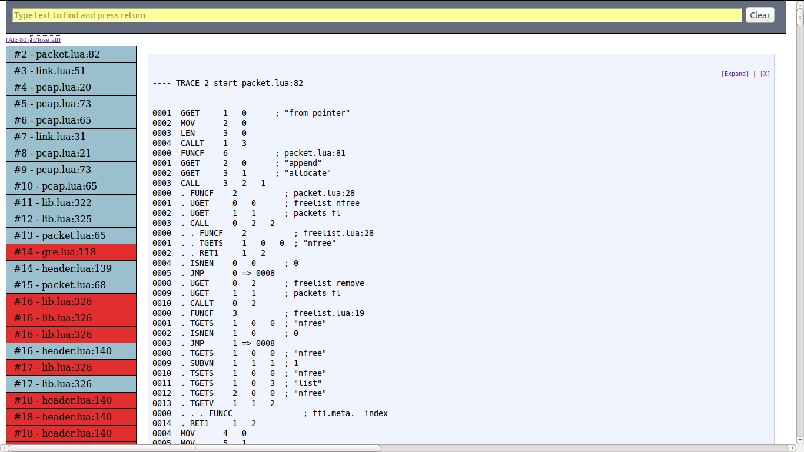
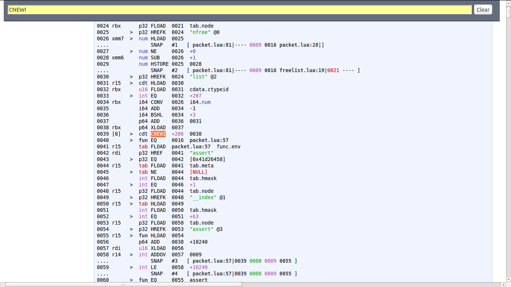
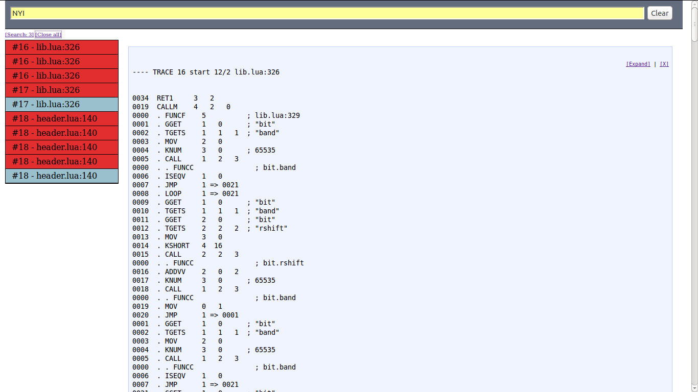

LuaJIT HTML Dump Prettifier
===========================

Introduction
------------

lj-dump-pp is a prettifier of LuaJIT dump files in HTML format.

   * Prints out a summary of traces and when clicking in one of them opens up a detailed view of the traces.
   * Traces can be expanded / collapsed by sections.
   * Searchbox allows to filter out traces by searched text.
   * Toggle traces by state (all, aborted, completed, search result).

Dependencies
------------

* jQuery.


Install
-------

Run ```make``` to download jQuery.

Run
---

Before running ```lj-dump-pp``` you need a LuaJIT dump in HTML format. To generate such file, execute a program with LuaJIT and pass, at least, the 'H' flag to ```-jdump```.

```bash
$ luajit -jdump=+rsH <program.lua> > dump.html
```

Once ```dump.html``` is ready, run the ```lj-dump-pp``` to get a prettified version of the dump.

```
lj-dump-pp dump.html > dump-new.html
```

Screenshots
-----------

General overview prints out all traces, completed and aborted.



Use the searchbox to filter out traces containing a string, in this case we're looking for all traces containing allocations (CNEWI).



Search for aborted traces due to NYI (No-yet-implemented) bytecodes.


